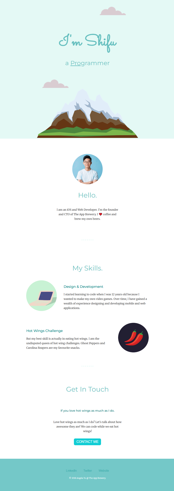

# My Portfolio

This is a personal portfolio website showcasing the skills and work of **Shifu**. The website includes a brief introduction, highlights of professional skills, and a fun section about the creator's love for hot wings. The portfolio is designed with a clean and modern look, featuring an engaging user interface and responsive design.

### Features:
- **Personal Introduction**: A brief description of Shifu, including professional background as an iOS and Web Developer.
- **Skills Section**: Highlighting the skills in design and development, as well as a playful section on hot wings challenges.
- **Contact Section**: A simple call-to-action for potential clients or collaborators to reach out.
- **Responsive Design**: The site adjusts well to different screen sizes for both desktop and mobile devices.

### Screenshots

### Technologies Used
- HTML
- CSS
- JavaScript
- Fonts: Sacramento, Montserrat, Merriweather

### Inspiration
This portfolio design is inspired by the work of [Angela Yu @ The App Brewery](https://themuellenator.github.io/).

### Getting Started
1. Clone or download the repository.
2. Open `index.html` in your browser.
3. Enjoy browsing through my portfolio!

### License
This project is licensed under the MIT License - see the [LICENSE](LICENSE) file for details.
